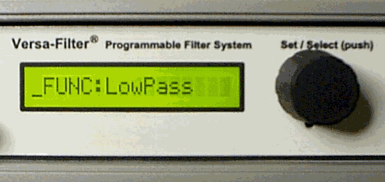
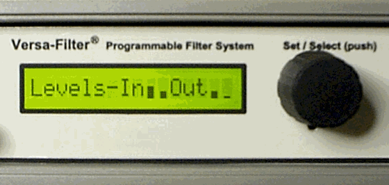

# Versa-Filter
## A programmable Digital Filter with analog I/O. Hardware and software.

The Versa-Filter is a versatile signal conditioning and digital filter system with analog inputs and outputs. The basic unit has two independent DC to 20 kHz channels, programmable gain amplifiers, a liquid crystal display and RS-232 serial control interfaces. A stereo 16-bit sigma-delta CODEC performs the A/D and D/A conversion and a fixed point digital signal processor (DSP) performs low-pass, high-pass, band-pass, band-stop and notch filtering with a 1Hz tuning resolution.

I developed this as a commercial product and sold it from 1997 through 2007.

### 2 channel Versa-Filter system: 

### Versa-Filter modules and 32 channel system:

### Rotary-encoder with push-button used to set filter functions, frequencies and gains:

### VU-Level meter for inputs and outputs:

## Schematics

## What You'll Find
- **/doc src** - Source files for the PDF documentation.
- **/firmware** - C and Assembly code, written for the TMS320C2xx family of devices.
- **/hardware** - Schematic files in PDF and OrCAD (v10.3). Bill-of-Materials files.
- **/images** - images used in this document.
- **/matlab** - MATLAB support files.
- **.pdf** - PDF product documentation

## Important Note
This is a legacy design that uses the TMS320C203 TI DSP processor, which is no longer recommended for new designs. However, the processor and other parts are still available.

## Development Tools
I used TI’s Code Composer Studio v1.x and I have not done a build since 2001.

## License Note
The hardware directory has a different (non-MIT) license.

